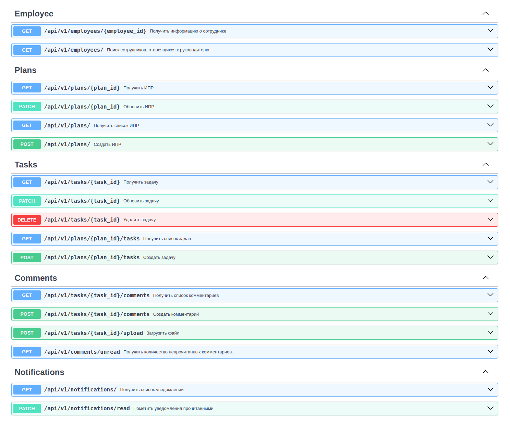

# **MVP индивидуального плана развития для сотрудников Альфа-Банка**


Репозиторий с исходным кодом: https://github.com/pashpiter/Hackathon_Alfa_task/  
Проект запущен по адресу: http://51.250.6.208/

___
## **Спецификация проекта**:
- для построения REST API используется фреймворк FastAPI
- в качестве хранилища данных проекта используется СУБД PostgreSQL
- раздачей статики и проксированием http-запросов занимается web-сервер nginx
- в качестве упрощённого механизма авторизации используется проверка Bearer-токенов. 
Токены статически хранятся в БД, выдача токенов не предусмотрена

___
## **Энодпоинты API**:




___
## **Как запустить проект локально**:

- Склонируйте репозитарий:
```
git clone git@github.com:pashpiter/Hackathon_Alfa_task.git
```

- Установите Docker согласно инструкции с официального сайта: _https://docs.docker.com/_
- В папке infra создайте папку env с файлами переменных окружения (в качестве 
примера можно взять папку env.example):

```
# env/general

# Server
SERVER_HOST=127.0.0.1
SERVER_PORT=80

# Versions
POSTGRES_VERSION=15
NGINX_VERSION=1.23.3

# Hosts
POSTGRES_HOST=postgres
NGINX_HOST=nginx
FASTAPI_HOST=fastapi

# Ports
POSTGRES_PORT=5432
FASTAPI_PORT=8001
```
```
# env/postgres

POSTGRES_DB=database
POSTGRES_USER=user
POSTGRES_PASSWORD=password
POSTGRES_SCHEMA=plans
```
```
# env/fastapi

APP_NAME="ИПР для сотрудников Альфа-Банка"
DEBUG=False
```

Список команд для управления работой сервиса:
```
make up             - запуск сервиса
make down           - остановка сервиса
make down-volumes   - остановка сервиса с удалением всех данных
```

Openapi документация доступна по адресам:
- Swagger: _http://<ip адрес сервера>/api/v1/openapi_
- ReDoc: _http://<ip адрес сервера>/api/v1/redoc_

## **Разработчики**:
[Павел Дровнин](https://github.com/pashpiter) - Тимлид

[Александр Бондаренко](https://github.com/dcomrad) - Разработчик

[Денис Заборовский](https://github.com/danlaryushin) - Разработчик

[Иван Павлов](https://github.com/GUSICATC) - Разработчик
